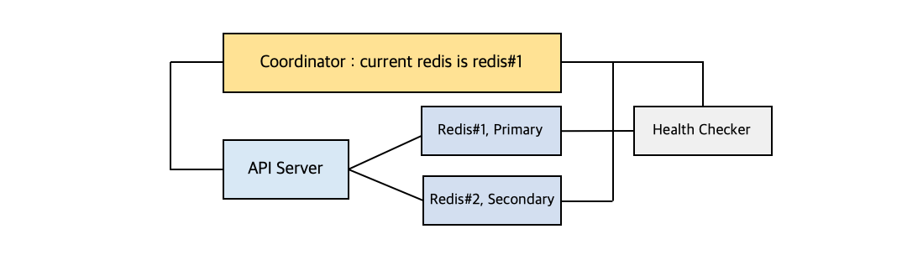

# Redis

다음 세미나 내용을 기반으로 정리 <br/>

우아한 레디스 - 강대명 : <https://www.youtube.com/watch?v=mPB2CZiAkKM> <br/>
NHN FORWARD - Redis 야무지게 사용하기 : <https://www.youtube.com/watch?v=mPB2CZiAkKM> <br/>

## Redis 란?

 - In-Memory Data Structure Store
 - Support data structures
 - Remote 에 위치
 - 프로세스로 존재
 - Key-Value 구조 관리 / 비관계형
 - Only 1 Committer

### Cache! Speed!
<sup>In-Memory Data Structure Store</sup><br/>

결과를 미리 저장해두었다가 빠르게! / 단, Disk가 아닌 Memory에 저장을 하기에 수용력(용량)은 적음. <br/>
<br/>

<b>그래서 어디서 사용함?</b>

** 파레토의 법칙 : 사회에서 일어나는 현상의 80%는 20%의 원인으로 인하여 발생한다.

1. Look Aside Cache (READ) = Lazy Loading
```
                          ┏━━(Cache) [1] Cache에서 데이터 확인
(Client)━━━━━(WebServer)━━┫
                          ┗━━(DB)    [2] 없을 시 DB에서 Select
                                     [3] DB에서 가져온 데이터를 Cache에 저장
```
** Cache Warming : 많이 쓰일것 같은 데이터를 DB에서 Cache로 인위적으로 데이터를 옮기는 작업 </br>

2. Write Around / Write Through (WRITE)
```
Write Around
         (Cache)
(App)━━━━━━━━━━━━━(DB)     Insert 시 Cache 저장하지 않음
         Pass.    Save!
```
캐시 내 데이터와 DB 내 데이턱 다를 수 있다는 단점이 있음.

```
Write Through
(App)━━━(Cache)━━━(DB)     Insert 시 Cache도 저장
         Save!    Save!
```
Write Around의 단점이 보안되긴 하나, 데이터 저장 시 2단계 Step을 거치기 때문에 상대적으로 느리다. <br/>
또한 의미없는 데이터가 Cache에 담길 경우 리소스 낭비가 생길 수 있기 때문에 해당 방식을 사용 시 <code>Expire Time</code>를 설정하여 데이터 보관에 유효기간을 만들어 주는 것이 좋다.

3. Write Back (WRITE)
```
[1] 모든 데이터를 Cache에만 저장
                          ┏━━(Cache) [2] 특정 시간마다 DB에 데이터 저장 후 삭제
(Client)━━━━━(WebServer)━━┫
                          ┗━━(DB)
```
<code> Insert 1번씩 호출 / 500개 데이터 저장</code> VS <code>Insert에 500개 데이터 삽입후 1번 호출 </code> 은 후자(Batch)가 훨신 빠르다. <br/>
이를 다음과 같이 Cache에 저장 후 Insert를 한번에 진행함으로써 데이터 Insert 시간을 줄일 수 있다.<br/>

단, In-Memory 다 보니 서버 장애 시 데이터가 사라질수 있다는 단점이 존재한다.

<b><code>Memcached</code> VS <code>Redis</code></b><br/>
<sup>Support data structures</sup><br/>


Distributed Memory Caching System 에는 대표적으로 <code>Memcached</code>와 <code>Redis</code> 가 존재한다. 이 둘의 가장 큰 차이는 <code>Collection</code>의 유무이다. <br/>
<code>Redis</code>는 <code>Collection</code>가 존재하기에 개발의 <code>편의성</code>은 높아지고 <code>난이도</code>는 낮아진다. / 덤으로 Replication도 가능!

** Replication:

<b>Race Condition</b><br/>
<p align="center"></p>
다음과 같이 타이밍이나 순서가 결과값에 영향을 줄 수 있는 상태를 <code>Race Condition</code>라고 한다. <br/>
<code>Reids</code>는 자료구조가 Atomic 하기 때문에 Race Condition을 쉽게 피할 수 있다. (단, 발생하지 않는 것은 아니다.) <br/>
<br/>


<b>그래서 Redis는 ... </b><br/>
 - Remote Data Store; 여러서버에서 데이터를 공유하고 싶을때 <br/>
** 1대라면 전역 변수를 사용하면 되지않을까? <br>
-> Redis 자체가 <code>Atomic</code>을 보장 (Single Thread 이기 때문에 이슈가 덜하다.)
 - 인증 토큰 등.. 을 저장
 - Ranking 보드로 사용 (Sort Set을 사용하여 쉽게 구현)
 - 유저 API Limit
 - Job Queue

---

## Redis Collections 
Redis에서 지원하는 콜랙션은 다음과 같다.

- Strings
- List
- Set
- Sorted Set
- Hash

### Strings
가장 기본적인 데이터 타입 / 단일 Key / Key-Value 가 <code>1 대 1</code> 관계 / Key, Value가 최대 512MB 길이<br/>

<b>삽입 / 조회 / 수정 / 삭제</b>

<code>SET</code>, <code>SETNX</code>, <code>GET</code>, <code>GETSET</code>, <code>DEL</code>, <code>GETDEL</code>, <code>RENAME</code>

``` redis
SET <Key> <Value>       // 삽입 및 수정
SETNX <Key> <Value>     // only 삽입 (Key 존재 시 Fail) 
GET <Key>               // 조회
GETSET <Key> <Value>    // 조회 후 수정
RENAME <Old Key> <New Key> // Key 수정
DEL <Key1> <Key2> ..    // 삭제 
GETDEL <Key>            // 조회 후 삭제 

// 예시
SET token:a123 Junnikym
SETXN token:a123 Junni        -> 결과 : 0 // 실패; Key가 이미 존재하기 때문
GET token:a123                -> 결과 : Junnikym
GETSET token:a123 HelloRedis  -> 결과 : Junnikym // 출력 후 값 수정
RENAME token:a123 token:b123  
DEL token:b123                
또는                           
GETDEL token:b123             -> 결과 : Junnikym // 이후 삭제
// GETDEL 은 Version 6.2.0 부터 사용 가능
```

<b>여러개의 K-V를 삽입 / 조회</b>

<code>MSET</code>, <code>MSETXN</code>, <code>MGET</code>

``` redis
MSET <Key1> <Value1> <Key2> <Value3> ...    // MSETXN 같은 형식 
MGET <Key1> <key2> ...
```

<b>단순 증감 연산</b>

증가 : <code>INCR</code>, <code>INCRBY</code>, <code>INCRBYFLOAT</code> <br/>
감소 : <code>DECR</code>, <code>DECRBY</code> <br/>
``` redis
SET user:123:score 100 

// 증가
INCR user:123:score      -> 101 (1 증가)
INCRBY user:123:score 4  -> 105 (4 증가)

// 감소
DECR user:123:score        -> 104 (1 감소)
DECRBY user:123:score 110  -> -6 (110 감소)

// version 2.6 이상
INCRBYFLOAT user:123:score -4.5 -> -10.5 (-4.5 증가) 
``` 
<code>~BY~</code> 키워드는 모두 음수 사용이 허용된다; <code>INCRBY</code>에 음수를 사용한다면 감소가 <code>DECRBY</code>를 사용한다면 증가가 된다.  

<b>만료시간 설정</b>

<code>GETEX</code> : 조회 후 설정한 만료시간 설정; 시간이 지난 뒤 대상이 삭제된다.

아래 키워드를 통해 시간 단위를 바꿔가며 설정이 가능하다.

| 키워드 | 시간 단위 |
|---|---|
| EX | Second |
| PX | MilliSecond |
| EXAT | Timestamp Seconds |
| PXAT | Timestamp MilliSeconds |
| PERSIST | 만료 설정 삭제 |

``` redis
GETEX <Key> EX 10          -> 조회 & 10초 후 삭제
GETEX <Key> PX 1000        -> 조회 & 1초 후 삭제
```

<code>SETEX</code>, <code>PSETEX</code> : 값, 만료시간 설정; 단, <code>SETEX</code>은 Seconds 단위이며 <code>PSETEX</code>는 MilliSeconds 단위.
<code>TTL</code>, <code>PTTL</code> : 지정한 Expire 까지 남은 시간 (<code>PTTL</code>은 MilliSeconds 단위)

``` redis
SETEX <Key> 5 <VALUE>      -> 설정 & 5초 후 삭제
PSETEX <Key> 1000 <VALUE>  -> 설정 & 1초 후 삭제

// SET 또한 EX, PX 같은 키워드를 사용할 수 있음.
SET <Key> <VALUE> EX <ExpireTime>
```

<b>추가 및 저장 그리고 Subquery</b>

<code>APPEND</code> 키워드를 통해 기존에 있는 키에 값을 추가 또는 값을 새로 추가가 가능하다. <br/>

``` redis
APPEND key1 Hello       -> 5  // key1 생성 및 key1 길이 반환
APPEND key1 Redis       -> 10 // key1 뒤 'Redis' 추가 및 길이 반환
GET key1                -> HelloRedis
```

** <code>STRLEN</code> 키워드를 통해 문자열 길이를 알 수 있다; ```STRLEN <KEY>```

Enterprise 서버 부터는 Subquery 기능이 사용 가능하다. (단 몇몇 키워드는 Enterprise가 아니여도 SubQuery가 사용가능)
``` redis
APPEND <Key> (GET <Otherkey>)
```

<code>SETRANGE</code>, <code>GETRANGE</code> 를 사용해서 위치를 지정하여 데이터 삽입 / 조회 가 가능하다.
``` redis
SET key1 HelloMySQL

SETRANGE key1 5 Redis   
// 5번째 이후 5글자(Redis가 5글자)인 MySQL을 Redis로 변경

GETRANGE key1 0 5       -> HelloR
GETRANGE key1 -5 -1     -> Redis // 음수 가능
// key1의 Value를 0~5 까지 인덱싱 (마지막 5번째 포함)
```

Enterprise 서버에서는 <code>STRALGO</code>(<code>LCS</code>) 기능을 지원한다. 이는 두 문자열이 어람나 유사한지 평가해준다. 아래 링크를 참조 <br/> 
ref : <http://redisgate.kr/redis/command/stralgo.php> <br/>
ref : <https://redis.io/commands/lcs>

<br/>

### Lists
Key-Value 가 <code>1 대 N</code> 관계 / Value는 입력된 순서대로 저장 / 주로 <code>Queue</code>, <code>Stack</code> 으로 활용. <br/>
<code>Blocking</code> 기능을 활용한 <code>Event Queue</code>

<b>생성 / 삭제</b>
Value가 존재 시 Key는 생성; 반면, Value가 없을 시 Key는 삭제. <br/>

생성 : <code>LPUSH</code>, <code>RPUSH</code>, <code>LPUSHX</code>, <code>RPUSHX</code>, <code>LINSERT</code> <br/>
조회 : <code>LRANGE</code> (<code>RRANGE</code>는 존재하지 않음), <code>LINDEX</code>, <code>LPOS</code> <br/>
수정 : <code>LSET</code>, <code>RPOPLPUSH</code> <br/>
삭제 : <code>LPOP</code>, <code>RPOP</code>, <code>LREM</code>, <code>LTRIM</code> <br/>

<code>L</code>, <code>R</code> 은 각각 <code>Left</code>, <code>Right</code> 를 의미한다.
따라서 다음과 같이 생성/삭제 가 가능하다.
``` redis
LPUSH <Key> <V1>        -> V1
LPUSH <Key> <V2>        -> V2, V1
RPUSH <Key> <V3>        -> V2, V1, V3
RPUSH <Key> <V4> <V5>   -> V2, V1, V3, V4, V5
LPUSH <Key> <V6> <V7>   -> V7, V6, V2, V1, V3, V4, V5
// LPUSH 시 가장 앞에 있는 Value 가 가장 Right 방향에 위치하게된다.  

LPOP <Key>              -> POP V7 // V6, V2, V1, V3, V4, V5
RPOP <Key>              -> POP V5 // V6, V2, V1, V3, V4

LRANGE <Key> <StartIndex> <EndIndex>
LRANGE <Key> 0 -1       -> 모두 출력 // 0 ~ 끝(-1)까지

LINSERT <Key> <BEFORE | AFTER> <Pivot> <Value>
LINSERT <Key> AFTER V6 Test     -> V6, Test, V2, V1, V3, V4
LINSERT <Key> BEFORE V6 Test    -> Test, V6, Test, V2, V1, V3, V4

LINSERT <Key> <BEFORE | AFTER> <Index> <Value> BY INDEX
// 해당 기능은 Enterprise에서 사용 가능
```
<code>RPOPLPUSH</code> 키워드를 통해 Key1의 가장 Right에 있는 요소를 Key2의 Left에 추가 할 수 있다.
``` redis
RPOPLPUSH <Key1> <key2>

LSET <Key> <Index> <Value>
LSET <KEY> 0 "Hello"        -> 0번째 리스트를 Hello로 변경
```

> <code>~PUSHX</code>의 경우 Key를 생성하지 않는다 따라서 List가 존재하지 않을 시 동작하지 않는다.
> 이는 새로운 Key를 생성하지 않기 때문에 불필요한 데이터 흐름을 막을 수 있다.

<code>~REM</code>를 사용할 시 지정한 Value 와 동일한 값을 찾아 삭제한다.
``` redis
LREM <Key> <Count> <Value>

RPUSH <Key> v1 v2 v1 v2 v1 v2 v1 v2 v1 v2
LREM <Key> 2 v2
     
(결과) v1 v1 v1 v2 v1 v2 v1 v2
```
```<Count>```가 음수 일 경우 반대로 스캔 후 삭제 (<code>LREM</code> 일 경우 Right 방향부터 N개 삭제)

** ```LPOS <Key> <Value>```를 통해 Index를 얻을 수 도 있음. 뒤에 붙일 수 있는 옵션이 존재하는데 이는 [여기](http://redisgate.kr/redis/command/lpos.php) 를 참조

<b>Blocking</b>

<code>B~POP</code> 키워드는 누가 데이터를 Push하기 전까지 대기하여 값을 가지고온다. 이 기능을 <code>Event Queue</code>로 사용하여 불필요한 Polling 프로세스를 막을 수 있다.

``` redis
BRPOP <Key> <Time>      -> <Time> 이 0일 시 계속 대기
 
* <Time> 이 지정시 <Time> 만큼 대기 후 응답 없을 시 종료

   ┏━[ Client A ]━━━━━┓   ┏━[ Client B ]━━━━━┓
 1 ┃ BRPOP queue 0    ┃   ┃                  ┃
   ┃                  ┃ 2 ┃ LPUSH queue "hi" ┃ 
 3 ┃ 0) queue         ┃   ┃                  ┃
 | ┃ 1) "hi"          ┃   ┃                  ┃
   ┗━━━━━━━━━━━━━━━━━━┛   ┗━━━━━━━━━━━━━━━━━━┛
* 만약 List에 이미 값이 존재 시 바로 출력이 된다.
* <Key> 는 여러개 지정이 가능하다.
```

<br/>

### Sets
Key-Value 가 <code>1 대 N</code> 관계 / 데이터가 있는지 없는지 확인하는 용도로 많이 사용 / Java의 Set과 같은 특징 <br/>
예를 들어 특정 유저를 Follow 하는 목록을 저장하는 등.. 에 사용 할 수 있다.

생성 : <code>SADD</code>, <code>SMOVE</code> <br/>
조회 : <code>SMEMBERS</code>, <code>SCARD</code>, <code>SRANDMEMBER</code>, <code>SISMEMBER</code>, <code>SSCAN</code> <br/>
삭제 : <code>SREM</code> <br/>

<code>SADD</code> 키워드는 여러개의 Value를 한번에 추가 가능하며 추가 시 <code>EX</code>, <code>PX</code> 등.. 의 키워드를 활용하여 만료시간을 지정할 수 있다. <br/>
``` redis
SADD <Key> <Value>
SADD <Key> <V1> <V2> ..
SADD <Key> <Value> EX 1000

SMOVE <KeyLhs> <KeyRhs> <TargetValue>
-> <KeyLhs>의 <TargetValue>를 제거 후 <KeyRhs>에 추가.
```

<code>SREM</code> 키워드를 통해 요소를 삭제 할 수 있다.
``` redis
SREM <Key> <TargetValue>

SPOP <Key>      -> <Key> 중 무작위로 하나를 조회 후 삭제
```

<code>SMEMBERS</code> 키워드를 통해서 모든 데이터를 조회 할 수 있으며 <code>SISMEMBER</code> 키워드를 통해 하나의 데이터가 Key에 존재하는지 알 수 있다.
``` redis
SMEMBERS <Key>
SMEMBERS <Key> <SORT|DESC>
-> SORT 또는 DESC 키워드를 뒤에 추가하면 오름차순 또는 내림차순으로 정렬하여 조회 가능 

SISMEMBER <Key> <Value>
-> <Key>에 <Value>가 존재 시 1 반환, 아닐 시 0 반환

SCARD <Key>
SLEN <Key>
-> <Key>의 요소 갯수를 반환

SUNION <Key1> <Key2> 
SINTER <Key1> <Key2> 
SIDIFF <Key1> <Key2> 
-> 각각 두 Key에 관한 합집합과 교집합, 차집합을 얻을 수 있으며 Sort 기능 사용가능.

S~STORE <NewKey> <Key1> <Key2>
-> 위 합집합, 교집합, 차집합 연산을 통해 나온 결과를 새로운 Set으로 저장.
* 만약 <NewKey> 에 이미 값이 들어가 있다면 지워지고 다시 저장됨. 

```
<code>SRANDMEMBER</code> 키워드를 통해 Key에 존재하는 값 중 랜덤으로 하나를 반환받을 수 있다.
``` redis
SRANDMEMBER <Key>
```
Key를 조회 시 Value가 많으면 Redis가 이를 처리하기위해 멈출 수 가 있다. 이를 방지하기위해 <code>SCAN</code> 이라는 키워드를 사용한다.
``` redis
KEYS           -> 모든 Key를 조회
SCAN <Cursor>  -> 몇개의 Key만 조회 후 다름 순서부터 조회 할 수 있는 Cursor 반환

SSCAN <Key> <Cursor> -> 몇개의 Value / 다음 Cursor

SSCAN <Key> <Cursor> MATCH <Pattern>
-> 다음과 같이 패턴과 Match 되는 <Value>를 얻을 수 도 있다.
에시)
SSCAN <Key> <Cursor> MATCH Hello*
-> 1) HelloMySQL
   2) HelloRedis
   
SSCAN <Key> <Cursor> MATCH <Pattern> Count <N>
-> Count 키워드를 통해 갯수를 지정 가능, 하지만 정확한 갯수를 보장하지 않음.
```

<br/>

### Sorted Sets (ZSets)
Key-(Value, Score)로 구성 / Score로 Sort / 집합이라는 의미에서 Value를 Member라 부름. <br/>
예를 들어 ScoreBoard를 구현 하는 등.. 에 사용할 수 있다. <br/>

* ZSets를 사용할 때 주의해야할 점은 Score가 <code>Double</code> 타입이기 때문에 실수가 표현 못하는 정수가 존재한다.

<code>Sets</code>에서 <code>SADD</code>로 추가한다면 <code>ZADD</code>를 사용하여 <code>ZSets</code>에 값을 추가할 수 있다.
``` redis
ZADD <Key> <Score> <Value>
ZADD <Key> <Score> <Value> EX 5
ZADD <Key> <S1> <V1> <S2> <V2> ..

// 조회
ZRANGE <Key> <StartIndex> <EndIndex
ZREVRANGE <Key> <StartIndex> <EndIndex>
```
다른 자세한 키워드는 [여기](http://redisgate.kr/redis/command/zsets.php) 를 참고.

<br/>

### Hash

...

<br/>

---

## Collection 사용시 주의!
 - 하나의 컬랙션에 너무 많은 요소를 삽입하지 말것. <br/>
    -> 10,000 개 이하의 Item을 유지하는 것이 좋다고 한다.
 - Expire Time은 개별이 아닌 Collection 전체에 걸린다. <br/>
    -> 10,000 개의 Item을 가진 Collection이 Expire가 걸릴 경우 10,000 개가 다 지워

---

## Redis 운영 관련 주의

1. 메모리 관리 철저!
2. O(n) 관련 명령은 주의할 것 
3. Replication

---

### 1. 메모리 관리 철저 

- Physical Memory 이상 사용할 경우 문제 발생
  - Swap 존재 시 메모리 Page 접근마다 속도 저하 (Swap이 이루어진 Memory Page는 계속 Swap이 발생)
  - Swap이 없으면 OOM(Out Of Memory)에 의해 죽게됨.
  - 많은 업체가 메모리가 Swap을 쓰고 있다는 것을 잘 모른다고한다. -> 모니터링을 계속해야함. 
  
- RSS 값을 모니터링하자!


- <code>MaxMemory</code>를 설정하더라도 이보다 더 사용할 수 있음. 
  - <code>메모리 파편화</code> 때문에 <code>MaxMemory</code>를 설정하더라도 이보다 더 사용할 수 있음. <br/>
     | 예를 들어 Memory Page Size가 4096 일 때, 메모리를 1 만큼 할당 요청하더라도 실제로 4096 만큼 할당한다. <br/>
     | 만약 여기서 4096 만큼 또 할당 받았을 때 실제로 4097 만큼 사용하고 있지만 8192 만큼 메모리를 할당받아 사용하는 것. <br/>
     | ** 자세한 내용은 [여기](https://jeong-pro.tistory.com/91) 를 참고 
  - Redis는 메모리 할당/해제 관리에 MemoryPool을 사용하지 않음 -> <code>Memory Allocate</code>에 따라 성능이 좌지우지
  - Redis는 <code>JEMalloc</code>을 사용한다. Redis 4.x 버전부터 JEMalloc에 힌트를 주는 기능 추가 <br/> But, JEMelloc 버전에 따라 다르게 동작 할 수 있다. <br/>
     | 3.x 버전은 실제 Used Memory가 2GB로 보고되지만 실제 11GB의 RSS를 사용하는 경우가 자주 발생.
  - 다양한 사이즈를 가지는 데이터보다 유사한 크기의 데이터를 사용하는 것이 파편화를 막기 좋다.
  
<sub>
** MaxMemory : MaxMemory 이상 메모리 사용 시 랜덤한 Key 또는 Expire가 지정된 것을 Redis가 자동으로 지워 메모리를 확보 후 메모리를 사용 <br/>
** <code>MemoryPool</code>에 대해서는 [여기](https://www.ikpil.com/1151) 와 [여기](https://m.blog.naver.com/kbm0996/221062731470) 를 참고 <br/>
** <code>JEMalloc</code>에 대해서는 [여기](http://channy.creation.net/project/dev.kthcorp.com/2011/05/12/last-free-lunch-facebooks-memory-allocator-jemalloc/index.html) 를 참고 <br/>
</sub>


- 큰 메모리를 사용하는 Instance 보다 작은 메모리를 사용하는 Instance 여러개가 더 안전함
  - Redis는 쓰기 시 <code>Copy on Write</code> 방식으로 작동.
  - 쓰기 시 <code>fork()</code>를 수행하여 갱신할 메모리 페이지를 복사한 후 쓰기 연산
  - 이는 최대 메모리를 2배까지 사용할 수 있다. <br/><br/>
  - 예시 1 ) 24GB Instance 사용 시, fork() -> 24GB (+24GB) 사용
  - 예시 2 ) 8GB Instance 3개 사용 시, fork() -> 8GB*3 (+8GB) 사용 

<b>메모리가 부족할 때는?</b>
1. Migration (메모리를 60% ~ 70% 사용할 경우 이전에 대해 생각) <br/> 
   -> 메모리가 빡빡하면 Migration 중 문제가 발생할 수 있다.
2. 존재하는 데이터를 줄이기 (데이터를 일정 수준에서만 사용하도록)<br/>
   -> 다만 Swap을 사용중이면 프로세스를 재시

<b>메모리를 줄이기 위한 설정</b>

다음은 메모리를 많이 사용하는 자료구조이다.

   - Hash ( HashTable을 사용 )
   - Sorted Set ( Skiplist와 HashTable을 사용 )
   - Set ( HashTable을 사용 )

In-Memory 이기 때문에 적은 개수라면 선형 탐색을 하더라도 충분히 빠르다. 따라서 속도는 조금 느리더라도 메모리를 적게먹는 <code>Ziplist</code>를 List, Hash, SotedSet 등을 대체해서 처리 ( 아래 설정을 사용 ) 
- <code>hash-max-ziplist-entries</code>, <code>hash-max-ziplist-value</code>
- <code>list-max-ziplist-entries</code>, <code>list-max-ziplist-value</code>
- <code>zset-max-ziplist-entries</code>, <code>zset-max-ziplist-value</code>

<br/>

### 2. O(n) 관련 명령은 주의할 것
Redis 는 <code>SingleThread</code> / 동시에 단 1개의 명령어만 실행가능 <br/>
단순한 Get/Set 명령어의 경우 초당 <code>100,000 TPS</code> 이상 처리 가능 (단, 성능에 따른 차이는 있다) <br/>
<sub>** TPS <sub>Transaction Per Second</sub> : 초당 처리할 수 있는 트렌젝션의 갯수.</sub> <br/>

여기서 문제점은 <code>SingleThread</code>이기 때문에 10,000개의 명령이 들어왔을때, 맨 처음 명령어가 1초 걸린다면 나머지 9,999개의 명령어는 1초 동안 대기해야한다. 이는 9,999개의 Timeout을 야기할 수 있다. <br/>

```
         ┏━[ Process Input Buffer ]━━━━━━┓
         ┃     ┏━[ Process Command ]━━━┓ ┃
    ┏━━━━━━━━┓ ┃ ┏━━━━━━━━┓ ┏━━━━━━━━┓ ┃ ┃
 ▶  ┃ Packet ┃ ▶ ┃ Packet ┃ ┃ Packet ┃ ┃ ┃
TCP ┗━━━━━━━━┛ ┃ ┗━━━━━━━━┛ ┗━━━━━━━━┛ ┃ ┃
         ┃     ┗━━━━━━━━━━━━━━━━━━━━━━━┛ ┃
         ┗━━━━━━━━━━━━━━━━━━━━━━━━━━━━━━━┛         
```
1. TCP는 Package이 끊어져서 올 수 있음.
2. <code>Process Input Buffer</code>에서 끊어진 Command를 연결하여 완성됬는지 확인함.
3. 이후 <code>Process Command And Reset</code>을 통해 <code>Process Command</code>로 Command를 이동 
4. <code>Process Command</code>에서 Command를 실행

따라서 Command하나를 처리하는 동안 Packet이 계속 쌓이게 된다. <br/>
Get / Set은 빠르기 때문에 처리하는데 문제가 없지만 처리속도가 길어질수록 문제가 생기는 것. <br/>

대표적으로 아래와 같은 명령어가 O(n)에 해당된다. <br/>
<code>KEYS</code>, <code>FLUSHALL</code>, <code>FLUSHDB</code>, <code>DELETE COLLECTIONS</code>, <code>GET ALL COLLECTIONS</code> <br/>

- <code>KEYS</code> 키워드를 사용하여 모니터링 하는 경우.
- <code>HASH</code>, <code>SET</code>, <code>ZSET</code> 에서 모든 데이터를 가져오는 경우.
- Spring Security OAuth Redis Token Store -> 단, 최신버전에서는 해결됨.

이 문제점들은 아래와 같이 해결할 수 있다.

- <code>KEYS</code> -> <code>SCAN</code> (하나의 긴 명령을 여러개의 짧은 명령으로 바꿈 -> 중간에 다른 명령 수행)
- 모든 Item 가져오기 -> 일부만 가져오기 / 큰 하나의 Collection을 작은 여러개의 Collection으로 <br/>
    -> 하나당 몇천개 이하로 저장을 권장.
- Spring Security OAuth Redis Token Store 은 원래 Access Token을 List에 저장했었음. <br/>
    -> 현재는 Set으로 바뀜.

<br/>

### 3. Replication

1. Redis Replication은 <code>Async Replication</code> -> <code>Replication Lag</code>이 발생 할 수 있다.
> 예시 ) A, B 서버가 존재 시 
> 1. A에 데이터가 들어옴
> 2. B에는 데이터가 없음      <- 여기서 문제 
> 3. (A->B) Replication
> 이는 서버의 부하에 따라 문제가 더 크개 발생할 수 있다.

2. <code>Primary Node</code>와 <code>Secondary Node</code>사이의 Replica 관계 설정
> Replicatio 설정 과정
> 1. Secondary에 replicaof 또는 slaveof 명령을 전달.
> 2. Secondary -> Primary 에게 Sync 명령 전달
> 3. Primary는 Fork()를 통해 현재 상태를 저장 후 Disk에 Dump (여기서 문제가 많이 발생)
> 4. 해당 정보를 Secondary에 전달 후 Fork 이후 데이터를 계속 Secondary에 전달.

3번에서 Fork()를 수행할 때, Disk Dump에서 성능도 많이 잡아먹고 Memory도 많이 쓰기 때문에 문제가 된다. <br/> 
** Diskless Replication : Disk를 사용하지 않고 Stream으로 Replication -> Disk IO는 많이 줄어 들지만 Memory를 많이 잡아먹는다

3. Redis Replication은 DBMS의 Statement Replication과 유사하다.<br/>
    따라서 NOW와 같은 <code>Nondeterministic</code>명령을 사용 시 Primary와 Secondary에서 각각 다른 결과를 초래할 수 있다.<br/>
    ** Nondeterministic : [여기](https://docs.microsoft.com/ko-kr/sql/relational-databases/user-defined-functions/deterministic-and-nondeterministic-functions?view=sql-server-ver15) 를 참고 / NOW 명령을 실행하는 시점에 따라 다른 결과를 가져올 수 있음. <br/>
    ** Statement Based Replication : [여기](https://nesoy.github.io/articles/2018-02/Database-Replication) 를 참고

<b>Replication 시 주의점!</b>
1. Fork() 시 메모리 부족 조심.
2. redis-cli --rdb 명령은 현상태의 메모리 스냅샷을 가져옴 -> 1번 문제와 같은 문제 야기
3. AWS나 Cloud의 Redis는 좀 다르게 동작, Fork() 없이 Replication 데이터 전달 (대신 느림)
4. 다수의 Redis 서버가 Replica를 가질 시, Network Bendwidth 보다 많은 양을 전달 해야하는 경우가 발생 <br/>
    | 이는 네트웍 이슈 때문에 Replication이 재시작되어 이슈가 발생 할 수 있다. <br/>
    | 그렇기 때문에 한대씩 Replication을 진행한다든지 대책을 새워야함.

<br/>

## Redis 분산

데이터의 특성에 따라 선택할 수 있는 방법이 달라진다. <br/>
서비스의 특성이나 상황에 따라 <code>Cache</code> 또는 <code>Persistence Data Store</code> 로 사용할 수 도 있다. <br/>

서비스 분산은 <code>Application</code> 에서 나눌 것인가 <code>Redis Cluster</code>에서 나눌 것인지로 나뉘게 된다. 
- Application
  - Consistent
  - Sharding
- Redis Cluster

### Application - Consistent Hashing

새로운 Redis 서버를 추가 시 많은 양의 데이터가 Rebalancing을 하게된다. 이 과정에서 많은 성능을 사용하게된다. <br/>

<code>Consistent Hashing</code>는 Key의 Hash를 이용하여 데이터를 분배한다. <br/>
이는 평균적으로 k/n 만큼의 데이터만 Rebalancing이 이루어지게 된다. ( k=키, n=서버 갯수) <br/>
만약 서버 A, B, C가 있다고 가정할 때, 서버 D를 추가 한다면 서버 C와 A 안의 데이터 일부만 Rebalancing이 이루어지면된다.

** 자세한 내용은 [우아한 레디스 1:00:00](https://youtu.be/mPB2CZiAkKM?t=3600) 또는 [여기](https://cla9.tistory.com/102) 를 참고

### Application - Sharding

하나의 데이터를 모든 서버에서 찾아야한다면 모든 서버에 부하를 주기 때문에 좋지않음. 따라서 데이터를 어떻게 나누는지는 중요한 문제.

<b>Range</b> <br/>
단순히 특정 범위(Range)를 정한 후, 해당 범위에 속할 경우 거기에 저장. <br/>
단, 문제는 상황에 따라 특정 서버에만 데이터가 몰리거나 너무 없는 경우가 발생할 수 있다.

<b>Modular</b> <br/>
n%k 로 서버의 데이터를 결정한다. 위 <code>Range</code>방식의 단점을 보안할 수 있다. <br/>
단, 서버 한대가 추가 시 재분배 양이 많아진다, 서버가 2배씩 늘어날 경우 균등하게 분배할 수 있지만 서버가 크면 클수록 늘려야하는 서버 양이 많아진다.

<b>Indexed</b> <br/>
해당 Key가 어디로 가야하는지 알려주는 서버를 따로 만듦. <br/>
단, Index Server에 장에가 발생할 경우 서비스 자체가 죽을 수 있다.

### Redis Cluster

- <code>Hash</code> 기반; <code>16384</code>개의 <code>HashSlot</code>으로 구분하며 Hash Algorithm은 <code>CRC16</code>을 사용. <br/>
** Slot = CRC16(key) % 16384 <br/>

- 만약 Key값이 <code>Key{...}</code>와 같이 괄호안에 <code>HashKey</code> 값을 입력 할 경우 CRC16(Key) 대신 입력된 HashKey 값을 활용한다.

- <code>Slot</code>Range 를 가지고 있음; Migration은 이 Slot 단위의 데이터를 다른서버로 전달.

<b>Redis Cluster의 장단점</b> <br/>

 - 단점 
   - 메모리 사용량이 많다.
   - Migration 자체는 관리자가 시점을 결정해야함.
   - 라이브러리의 구현이 필요함.

> Redis Cluster는 Primary 마다 Slot Range가 할당되는데, 요청 받은 키가 자신의 슬롯과 다를 경우 <code>-MOVED <올바른 슬롯></code>과 같이 알려준다.
> 이후 클라이언트가 다시 요청을 올바른 슬롯으로 재전송하여 처리해야하는데 이를 깔끔하게 구현하기 위해 라이브러리가 필요하다.

 - 장점
   - 자체적인 Primary, Secondary의 Failover
   - slot 단위의 데이터 관리

<br/>

## Redis Failover

 - Coordinator 기반
 - VIP / DNS 기반
 - Redis Cluster 기반

### Coordinator 기반
<code>zookeeper</code>, <code>etcd</code>, <code>consul</code> 와 같은 코디네이터를 사용

<p align="center"></p>

1. <code>Health Checker</code>를 통해 Primary가 정상임을 Check 한다.
2. <code>Health Checker</code>가 <code>#1</code> 서버가 Down되었는지 확인되면 <code>#2</code>를 Primary로 승격
3. <code>Coordinator</code> 에는 <code>#2</code>로 바뀌게 되며 <code>Notification</code> 기능을 통해 <code>API Server</code>에 Current Redis가 <code>#2</code>로 바뀜을 알림.

이미 Coordinator를 사용한다면 -> 생각보다 간단 <br/>
그게 아니라면 -> 해단 기능을 사용하도록 기능구현

### VIP / DNS 기반

** VIP : Virtual IP

1. <code>API Server</code>는 <code>127.0.0.10</code> 으로만 접속
2. Primary <code>#1</code>은 <code>VIP 127.0.0.10</code> 가 할당 되어있음.
3. <code>Health Checker</code>가 <code>#1</code>이 Down 되었을 때 <code>VIP 127.0.0.10</code>를 <code>#2</code>에 할당   
   - 이때 <code>#1</code>에 있던 모든 연결을 끊어주면서 클라이언트의 재접속을 유도

DNS는 VIP와 같은 방식을 사용하지만 도메인을 할당한다는 차이가 있다.

 - 클라이언트에 추가적인 구현이 필요없음
 - VIP 기반의 방식은 외부로 서비스를 제공한느 업자에게 유리
 - DNS 기반은 DNS Cache TTL을 관리해야함.
   - 사용하는 언어별 Cache 정책을 잘 알아야함

솔루션이 DNS를 Caching 할 경우 Health Checker가 무언가를 바꾸어도 요청이 제대로 가지 않을 수 있음. <br/>
 -> Check 정책을 잘 알아야 함. 경우에 따라 DNS 정보를 다시 호출하지 않는 경우도 발생 
이는 VIP 기반의 방식을 하면 겪을 일 없음. / 하지만 DNS 기반의 방식은 DNS 설정만 바꾸면 되기에 좀 더 싸다.

<br/>