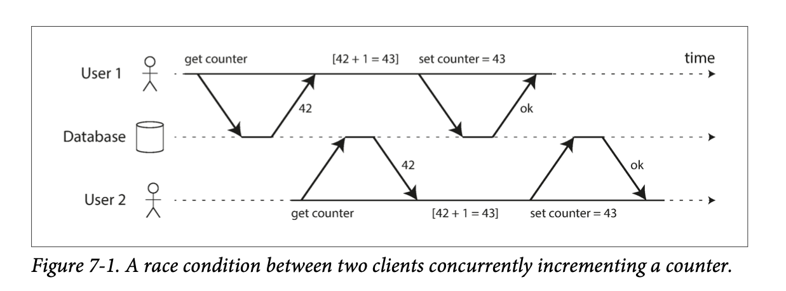

# Redis

## Redis 란?

 - In-Memory Data Structure Store
 - Support data structures
 - Remote 에 위치
 - 프로세스로 존재
 - Key-Value 구조 관리 / 비관계형
 - Only 1 Committer

### Cache! Speed!
<sup>In-Memory Data Structure Store</sup><br/>

결과를 미리 저장해두었다가 빠르게! / 단, Disk가 아닌 Memory에 저장을 하기에 수용력(용량)은 적음. <br/>
<br/>

<b>그래서 어디서 사용함?</b>

** 파레토의 법칙 : 사회에서 일어나는 현상의 80%는 20%의 원인으로 인하여 발생한다.

1. Look Aside Cache (READ) = Lazy Loading
```
                          ┏━━(Cache) [1] Cache에서 데이터 확인
(Client)━━━━━(WebServer)━━┫
                          ┗━━(DB)    [2] 없을 시 DB에서 Select
                                     [3] DB에서 가져온 데이터를 Cache에 저장
```
** Cache Warming : 많이 쓰일것 같은 데이터를 DB에서 Cache로 인위적으로 데이터를 옮기는 작업 </br>

2. Write Around / Write Through (WRITE)
```
Write Around
         (Cache)
(App)━━━━━━━━━━━━━(DB)     Insert 시 Cache 저장하지 않음
         Pass.    Save!
```
캐시 내 데이터와 DB 내 데이턱 다를 수 있다는 단점이 있음.

```
Write Through
(App)━━━(Cache)━━━(DB)     Insert 시 Cache도 저장
         Save!    Save!
```
Write Around의 단점이 보안되긴 하나, 데이터 저장 시 2단계 Step을 거치기 때문에 상대적으로 느리다. <br/>
또한 의미없는 데이터가 Cache에 담길 경우 리소스 낭비가 생길 수 있기 때문에 해당 방식을 사용 시 <code>Expire Time</code>를 설정하여 데이터 보관에 유효기간을 만들어 주는 것이 좋다.

3. Write Back (WRITE)
```
[1] 모든 데이터를 Cache에만 저장
                          ┏━━(Cache) [2] 특정 시간마다 DB에 데이터 저장 후 삭제
(Client)━━━━━(WebServer)━━┫
                          ┗━━(DB)
```
<code> Insert 1번씩 호출 / 500개 데이터 저장</code> VS <code>Insert에 500개 데이터 삽입후 1번 호출 </code> 은 후자(Batch)가 훨신 빠르다. <br/>
이를 다음과 같이 Cache에 저장 후 Insert를 한번에 진행함으로써 데이터 Insert 시간을 줄일 수 있다.<br/>

단, In-Memory 다 보니 서버 장애 시 데이터가 사라질수 있다는 단점이 존재한다.

<b><code>Memcached</code> VS <code>Redis</code></b><br/>
<sup>Support data structures</sup><br/>


Distributed Memory Caching System 에는 대표적으로 <code>Memcached</code>와 <code>Redis</code> 가 존재한다. 이 둘의 가장 큰 차이는 <code>Collection</code>의 유무이다. <br/>
<code>Redis</code>는 <code>Collection</code>가 존재하기에 개발의 <code>편의성</code>은 높아지고 <code>난이도</code>는 낮아진다. / 덤으로 Replication도 가능!

** Replication:

<b>Race Condition</b><br/>
<p align="center"></p>
다음과 같이 타이밍이나 순서가 결과값에 영향을 줄 수 있는 상태를 <code>Race Condition</code>라고 한다. <br/>
<code>Reids</code>는 자료구조가 Atomic 하기 때문에 Race Condition을 쉽게 피할 수 있다. (단, 발생하지 않는 것은 아니다.) <br/>
<br/>


<b>그래서 Redis는 ... </b><br/>
 - Remote Data Store; 여러서버에서 데이터를 공유하고 싶을때 <br/>
** 1대라면 전역 변수를 사용하면 되지않을까? <br>
-> Redis 자체가 <code>Atomic</code>을 보장 (Single Thread 이기 때문에 이슈가 덜하다.)
 - 인증 토큰 등.. 을 저장
 - Ranking 보드로 사용 (Sort Set을 사용하여 쉽게 구현)
 - 유저 API Limit
 - Job Queue

## Redis Collections 
Redis에서 지원하는 콜랙션은 다음과 같다.

- Strings
- List
- Set
- Sorted Set
- Hash

### Strings
가장 기본적인 데이터 타입 / 단일 Key / Key-Value 가 <code>1 대 1</code> 관계 / Key, Value가 최대 512MB 길이<br/>

<b>삽입 / 조회 / 수정 / 삭제</b>

<code>SET</code>, <code>SETNX</code>, <code>GET</code>, <code>GETSET</code>, <code>DEL</code>, <code>GETDEL</code>, <code>RENAME</code>

``` redis
SET <Key> <Value>       // 삽입 및 수정
SETNX <Key> <Value>     // only 삽입 (Key 존재 시 Fail) 
GET <Key>               // 조회
GETSET <Key> <Value>    // 조회 후 수정
RENAME <Old Key> <New Key> // Key 수정
DEL <Key1> <Key2> ..    // 삭제 
GETDEL <Key>            // 조회 후 삭제 

// 예시
SET token:a123 Junnikym
SETXN token:a123 Junni        -> 결과 : 0 // 실패; Key가 이미 존재하기 때문
GET token:a123                -> 결과 : Junnikym
GETSET token:a123 HelloRedis  -> 결과 : Junnikym // 출력 후 값 수정
RENAME token:a123 token:b123  
DEL token:b123                
또는                           
GETDEL token:b123             -> 결과 : Junnikym // 이후 삭제
// GETDEL 은 Version 6.2.0 부터 사용 가능
```

<b>여러개의 K-V를 삽입 / 조회</b>

<code>MSET</code>, <code>MSETXN</code>, <code>MGET</code>

``` redis
MSET <Key1> <Value1> <Key2> <Value3> ...    // MSETXN 같은 형식 
MGET <Key1> <key2> ...
```

<b>단순 증감 연산</b>

증가 : <code>INCR</code>, <code>INCRBY</code>, <code>INCRBYFLOAT</code> <br/>
감소 : <code>DECR</code>, <code>DECRBY</code> <br/>
``` redis
SET user:123:score 100 

// 증가
INCR user:123:score      -> 101 (1 증가)
INCRBY user:123:score 4  -> 105 (4 증가)

// 감소
DECR user:123:score        -> 104 (1 감소)
DECRBY user:123:score 110  -> -6 (110 감소)

// version 2.6 이상
INCRBYFLOAT user:123:score -4.5 -> -10.5 (-4.5 증가) 
``` 
<code>~BY~</code> 키워드는 모두 음수 사용이 허용된다; <code>INCRBY</code>에 음수를 사용한다면 감소가 <code>DECRBY</code>를 사용한다면 증가가 된다.  

<b>만료시간 설정</b>

<code>GETEX</code> : 조회 후 설정한 만료시간 설정; 시간이 지난 뒤 대상이 삭제된다.

아래 키워드를 통해 시간 단위를 바꿔가며 설정이 가능하다.

| 키워드 | 시간 단위 |
|---|---|
| EX | Second |
| PX | MilliSecond |
| EXAT | Timestamp Seconds |
| PXAT | Timestamp MilliSeconds |
| PERSIST | 만료 설정 삭제 |

``` redis
GETEX <Key> EX 10          -> 조회 & 10초 후 삭제
GETEX <Key> PX 1000        -> 조회 & 1초 후 삭제
```

<code>SETEX</code>, <code>PSETEX</code> : 값, 만료시간 설정; 단, <code>SETEX</code>은 Seconds 단위이며 <code>PSETEX</code>는 MilliSeconds 단위.
<code>TTL</code>, <code>PTTL</code> : 지정한 Expire 까지 남은 시간 (<code>PTTL</code>은 MilliSeconds 단위)

``` redis
SETEX <Key> 5 <VALUE>      -> 설정 & 5초 후 삭제
PSETEX <Key> 1000 <VALUE>  -> 설정 & 1초 후 삭제
```

<b>추가 및 저장 그리고 Subquery</b>

<code>APPEND</code> 키워드를 통해 기존에 있는 키에 값을 추가 또는 값을 새로 추가가 가능하다. <br/>

``` redis
APPEND key1 Hello       -> 5  // key1 생성 및 key1 길이 반환
APPEND key1 Redis       -> 10 // key1 뒤 'Redis' 추가 및 길이 반환
GET key1                -> HelloRedis
```

** <code>STRLEN</code> 키워드를 통해 문자열 길이를 알 수 있다; ```STRLEN <KEY>```

Enterprise 서버 부터는 Subquery 기능이 사용 가능하다. (단 몇몇 키워드는 Enterprise가 아니여도 SubQuery가 사용가능)
``` redis
APPEND <Key> (GET <Otherkey>)
```

<code>SETRANGE</code>, <code>GETRANGE</code> 를 사용해서 위치를 지정하여 데이터 삽입 / 조회 가 가능하다.
``` redis
SET key1 HelloMySQL

SETRANGE key1 5 Redis   
// 5번째 이후 5글자(Redis가 5글자)인 MySQL을 Redis로 변경

GETRANGE key1 0 5       -> HelloR
GETRANGE key1 -5 -1     -> Redis // 음수 가능
// key1의 Value를 0~5 까지 인덱싱 (마지막 5번째 포함)
```

Enterprise 서버에서는 <code>STRALGO</code>(<code>LCS</code>) 기능을 지원한다. 이는 두 문자열이 어람나 유사한지 평가해준다. 아래 링크를 참조 <br/> 
ref : <http://redisgate.kr/redis/command/stralgo.php> <br/>
ref : <https://redis.io/commands/lcs>

<br/>

ref : <https://www.youtube.com/watch?v=92NizoBL4uA> <br/>
ref : <https://www.youtube.com/watch?v=mPB2CZiAkKM> <br/>